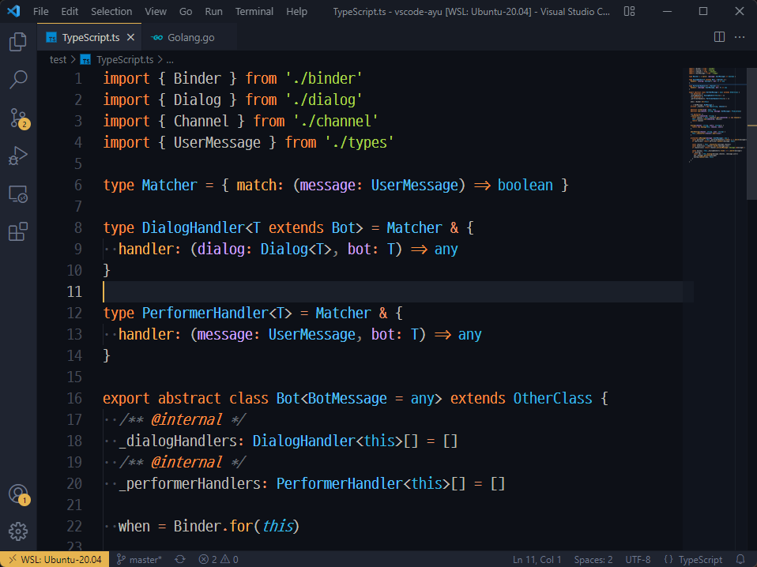
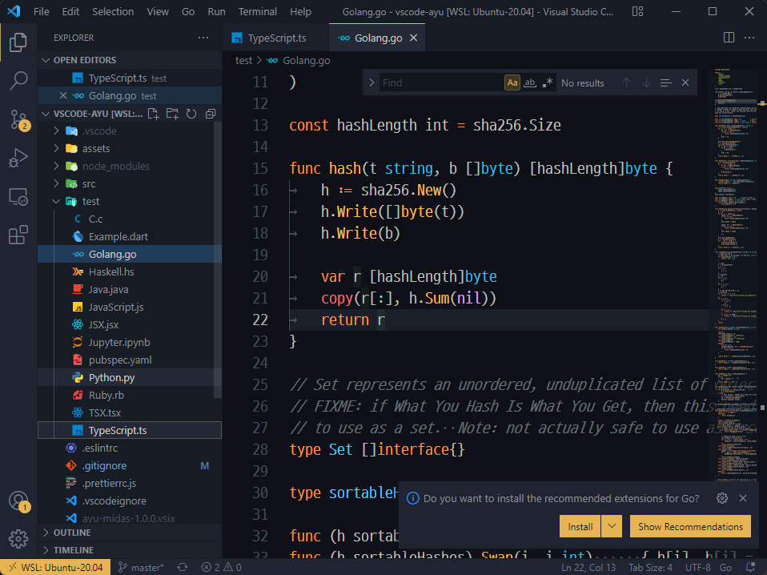

# ayu MiDas for VSCode

> Forked from https://github.com/ayu-theme/vscode-ayu

*ayu Dark* for the editor, *ayu Mirage* for UI, and extra tweaks for better visibility.

## Screenshots

> - Icon used: [Material Icon Theme](https://marketplace.visualstudio.com/items?itemName=PKief.material-icon-theme)
> - Font used: [D2Coding](https://github.com/naver/d2codingfont)

## Development

Same as [vscode-ayu](https://github.com/ayu-theme/vscode-ayu#development)

## Note

- This extension does **not contain** *ayu icon theme*.
- This isn't a theme maintained by the original [vscode Ayu](https://github.com/ayu-theme/vscode-ayu) author nor original [ayu theme](https://github.com/dempfi/ayu) author.
- Enhancement of syntax highlighting is not planned for now, but any suggestions or PRs are welcomed!

### Why yet another ayu fork?

I really love the syntax highlighting scheme and overall colors in *ayu* as it is.

However, IMO its UI with same-colored backgrounds makes it hard to focus on each section. Bordering isn't a help to this enough. Also, the UI foreground color is not bright enough to read comfortably. (well maybe it's all because of my poor monitor color adjustment but whatever)

When I tried Sublime Text 4, my go-to option was ayu-**dark** for *color scheme* (editor section) and ayu-**mirage** for *theme* (overall UI section). It was not perfect, but way better than applying the same theme for both! Unfortunately, VSCode has no option like this, and I couldn't find any ayu fork which has this concept.

That's why I made ayu MiDas for VSCode. Yep, this is a theme entirely for me. But I'd be happy if this could help someone else.
